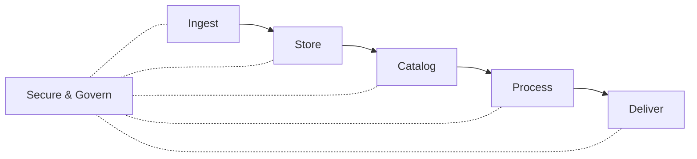
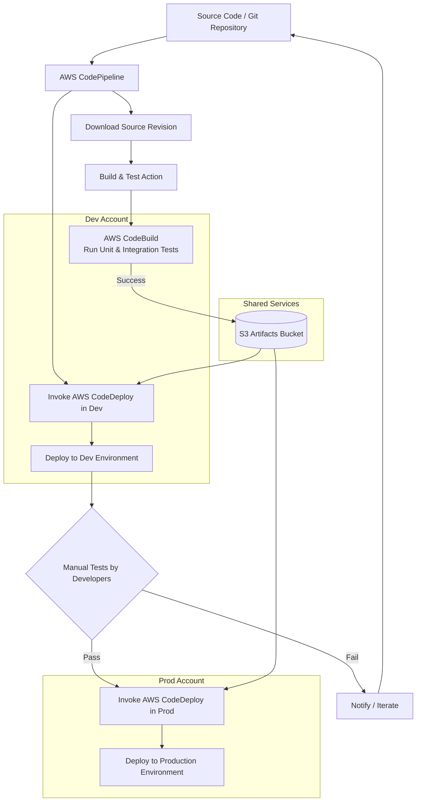

# AWS Data Engineering Foundations Review

This document also notes AWS GovCloud availability.

:star: = Available

:x: = Not Available

More information on currently available services can be found [here](https://docs.aws.amazon.com/govcloud-us/latest/UserGuide/using-services.html).

## Foundational Roles & Concepts

Goals and buzz words include data driven organization and data democratization.

However, data challenges are abundant... especially in government.

- Data and processing silos
- Excessive data movement
- Data duplication

Role of the **Data Engineer** to solve these challenges.

- Extract valuable insights from raw data
- Design, develop, and maintain data architectures
- Run Extract, transform, and load (ETL) pipelines for data consumers.

Overarching themes are:

1. Getting data from sources
2. Making it useful
3. Serving it to stakeholders

Detailed functions may include:

- Build and manage data infrastructure
- Ingest various sources
- Prepare the ingested data for analytics
- Catalog and document curated datasets
- Automate regular data workflows
- Ensure data quality, security, and compliance

Adjacent Roles include the following:

- Chief Data Officer (CDO) - Builds a culture of using data to solve problems and accelerate innovation
- Data Architect - Driven to architect technical solutions to meet business needs, focuses on solving complex data challenges to help the CDO deliver on their vision
- Data security officer - Ensures that data security, privacy, and governance are strictly defined and adhered to
- Data scientist - Constructs the means for quickly extracting business-focused insight  from data for the business to make better decisions
- Data analyst - Reacts to market conditions in real time, must have the ability to find data and perform analytics quickly and easily

## Data Discovery

Before architect-ing and deploying a data analytics system, the following questions must be answered.

1. Which data should be analyzed based on its value to the organization?
2. Who owns the data and where is it located?
3. Is the data usable in its current state or are transformations required?
4. Who exactly needs to consume the data?
5. After the data is curated and ready for consumption, how should it be presented?

**Data discovery** refers to the process of finding and understanding relevant data sources within an organization and the relationships between them. **It is the crucial first step!**
However, data discovery is routinely revisited to account for emerging sources.

Data discovery consists of (5) steps:

1. Define the business value, e.g. how does the data insight provide value to the organization?
2. Identify the data consumers, i.e. end users of the data insights.
   - Which insights are we currently extracting?
   - Which insights are on our roadmap?
   - What are the different consumption models?
   - Which tools or interfaces do the consumers use?
   - What are the data freshness requirements?
   - What is the total number of consumers and peak concurrency?
3. Identify the data sources like DBMS, files, logs, data types like structured or unstructured, and ingest modes like streaming versus batch.
4. Determine storage, catalog, and access requirements.
   - Answer why storage methods are being selected.
   - Determine long term volume requirements.
   - How do we manage governance requirements?
   - What is the disaster recovery strategy?
5. Determine the transformation requirements.

Remember to **focus on what exists, then what needs to be developed**

## AWS Data Services

Data solutions are often built in isolation with desperate ingestion, storage, management, and governance frameworks. This creates silos and we seek to build architectures that avoids this and puts data in the hands of all stakeholders.

A typical data workflow follows this pattern:

1. Ingest
2. Store
3. Catalog / indexed (to facilitate search)
4. Processing
5. Consumption / delivery
6. Security & governance



The following is a subset of common AWS solutions that can be used for multiple functions within a data workflow.

- **Data Lake** - A centralized repository for storage of structured, semi-structured, or unstructured data all in place. **AWS S3** provides a scalable solution for a Data Lake.
- **Ingest Services** - Getting data into your data lake can involve a number fo services.
  - :star:**AWS Data Migration Service (DMS)** allows for ingest of relational or non-relational databases.
  - :star:**AWS DataSync** allows for transfer of on-prem file shares, object stores, and Hadoop clusters on a scheduled basis.
  - :star:**AWS Data Firehose** can convert a data stream into formats like Parquet or ORC. It can decompress and perform custom transformations. (Some features limited in GovCloud)
  - :star:**AWS Managed Streaming for Kafka (MKS)** provides environment for building fully managed Kafka clusters for real time streaming applications. (**Amazon Kinesis** is its fully managed cousin with simpler AWS integration).
  - :star:**AWS IoT Core** can connect to billions of IoT devices.
  - :star:**AWS Transfer Family** automates file transfers in and out of S3 using SFTP.
- **Data Cataloging** is the process of keeping track of data assets; understanding what data is available, where it is located, and its lineage. THe catalog is the single source of truth about the contents of a data lake. **AWS Glue** creates a catalog to enable this function and it works similar to a managed instance of Apache Hive.
- **Processing Services** focus on the transformation and formatting of data to ensure it is in a usable state for the consumer. Several services are offered.
  - :star:**AWS Glue** - In addition to cataloging, AWS Glue allows for ETL services to prepare and cleanse data. It can help classify data, extract schema, and populate the data catalog.
  - :star:**Amazon Elastic MapReduce (EMR)** enables batch jobs on big data with Apache Spark or Hadoop. It can be run on elastic compute resources like **AWS EC2** or **AWS Elastic Kubernetes Service (EKS)**. It can run jobs stored on services like **AWS S3** and **AWS DynamoDB**. Often used for log analysis, ML applications, etc.
  - :star:**Amazon Managed Service for Apache Flink** conduct real time filtering, aggregation, joining, extraction or other transformations using Java, Scala, Python, or SQL.
- **Analytics Services** - Delivering transformed data to consumers and stakeholders also has many services available.
  - :star:**AWS Redshift** can analyze large structured datasets federated across many databases without moving the data to a central location.
  - :star:**AWS Athena** allows users to query data stored in **AWS S3** using SQL provides the data are in CSV, Parquet, or ORC format.
  - :star:**Amazon Elastic MapReduce (EMR)** enables batch jobs on big data with Apache Spark or Hadoop. It can be run on elastic compute resources like **AWS EC2** or **AWS Elastic Kubernetes Service (EKS)**. It can run jobs stored on services like **AWS S3** and **AWS DynamoDB**. Often used for log analysis, ML applications, etc.
  - :star:**AWS QuickSight** allows users to visualize and create dashboards big data using SQL, similar to Apache Superset. (us-east-1 region)
- **Security & Governance** - Security refers to protecting data from unauthorized access, breaches, or attacks. It involves safeguarding data confidentiality, integrity, and availability. While governance refers to policies, procedures, and processes that ensure the proper management, quality, and use of data.
  - :star:**AWS Lake Formation** is a service that centrally managed fine grained access controls. (limited GovCloud features)
  - :star:**IAM Roles** also manages fine grained access and permissions for human users, software users, and other microservices.
  - :star:**AWS Key Management Service (KMS)** allows users to create and manage encryption keys, control their usage, and integrate with other AWS services for data encryption.
  - :x:**AWS Macie** automatically discovers, classifies, and protects sensitive data such as PII.
  - :star:**AWS DataZone** can catalog, enable discovery, enable sharing, and govern data stored in AWS, on-prem, or in third party sources.
  - :star:**AWS Audit Manager** audits data usage to assess risk and compliance.

## Data Orchestration & Automation

Orchestration and automation of data workflows ensures pipelines do not become error-prone or too time consuming to manage.

**Orchestration** - the coordination of multiple services to define and manage the flow of data.

**Automation** - refers to using tools and services to perform repetitive data workflow tasks, e.g., like a CRON job.

Many AWS services are available to orchestrate data workflows.

- :star:**AWS Step Functions** - An ETL visualization services that executes Lambda functions, runs batch jobs in AWS Glue, AWS EMR, or streaming services like AWS Kinesis or Data Firehose. (Reminds me of NiFi)
- :star:**AWS Lambda** - Runs piece of code for open-ended tasks without having to provision servers. Can invoke other AWS services and microservice tasks within a workflow. Can be event driven by data sources like AWS S3, DynamoDB, Kinesis, SNS, or SQS.
- :star:**Amazon Managed Workflows for Apache Airflow (MWAA)** - Managed Apache Airflow service to orchestrate ingest, processing, transformations and loading or run queries for analytical workflows at scale.
- :star:**Amazon EventBridge** - A serverless service used to build event-driven applications. It can ingest from various sources and route events to various targets to invoke different steps in a workflow. *Unclear*
- :star:**AWS Simple Notification Service (SNS)** - A fully managed messaging service that enables message traffic to and from multiple endpoint simultaneously. Messages can be used to invoke Step Functions.
- :star:**AWS Simple Queue Service (SQS)** - A managed message queuing service to send, store, and retrieve multiple messages of various sizes asynchronously. In essense, a message queue that allows services to poll asynchronously and cue various jobs in a workflow.

## Enhanced Orchestration & Automation

While traditional ETL workflows are often sequential and delicate. Other approaches are available.

**Zero-ETL** - Query of data from its original source systems without requiring data movement to a new system and transformations prior to consumer. Several services have the ability to execute this approach depending on the data and use case.

- :star:**AWS Athena** Query data stored in **AWS S3** using SQL provides the data are in CSV, Parquet, or ORC format. Often used in conjunction with **Step Functions** and **Lambda Functions** to process and analyze query results.
- :star:**Amazon Redshift Streaming Ingest** - Can ingest streaming data without the need to stage in **AWS S3**, reducing an ETL task for common workflows.
- :star:**Amazon Aurora + Redshift** Allows for replication of data from Aurora to Redshift in near real-time.
- :star:**Amazon Redshift + AWS S3** Continuously ingest new files from S3 in near real time with no manual intervention.
- :star:**Amazon OpenSearch** allows for querying data directly from S3 without performing an extraction to OpenSearch itself. *Commonly used in log analysis use cases; more info required.*

**Serverless Architecture** - While not truly "serverless", this concept refers to building and running applications without having to manage infrastructure. All the server management is performed by the cloud service provider and you only pay for the compute you use, not for the overhead of a server at rest. **Most AWS services offer a serverless option.**

## Security & Monitoring

Security should focus on the following (5) areas:

1. Access Management ensuring only authorized users
2. Regulatory Requirements
3. Sensitive Data Protections
4. Data and Networking Security
5. Data Auditability

Multiple security services are available, some of these were already mentioned in the [Data Services](#aws-data-services) section of this document.

### Access Management

- :star:**AWS IAM Roles** - manages fine grained access and permissions for human users, software users, and other microservices at individual and group levels.
- :star:**AWS Certificate Manager (ACM)** - Provision, manage, and deploy SSL/TLS certificates for services and apps.

### Regulatory Compliance

- :star:**AWS Audit Manager** - automatically collects and structures audit trails from AWS services and generates audit-friendly reports.
- :star:**AWS Config** - provides configuration management and auditing of AWS services to assesss security compliance.

### Data Protections

- :x:**AWS Macie** - uses AI/ML to automatically discover, classify, and protect sensitive data such as PII.
- :star:**AWS Key Management Service (KMS)** allows users to create and manage encryption keys, control their usage, and integrate with other AWS services for data encryption.
- :star:**AWS Glue** - In addition to cataloging and ETL operations, Glue allows users to mask data and encrypt data in conjunction with AWS KMS.

### Data and Networking Security

- :star:**AWS Control Tower** - Enables the set-up and control of multi-user AWS environments.
- :star:**AWS Guard Duty** - A threat detection service that monitors networking, applications, and user activity.
- :star:**AWS Web Application Firewall (WAF)** - protects web applications from common exploits and attacks.
- :star:**AWS Shield** - Protects applications from DDOS attacks.

### Data Auditability

- :star:**AWS CloudTrail** - Provides logging and auditing of API calls in you AWS environment and management of events in AWS user accounts.
- :star:**AWS Lake Formation** - Automatically catalogs the source and destination of data movement. It provides metadata of origin, location, and transformation of data; a true catalog of lineage.
- :star:**AWS Glue** - Also tracks metadata associated with movements between AWS S3, AWS Redshift, and other services.

### Security Best Practices

- Impliment access controls using **IAM** roles to control who can access certain resources.
- Encrypt data at rest using **AWS KMS** and encrypt data-in-transit with HTTPS/TLS protocols.
- Use masking and anonymization to protect PII while still enabling analytics.
- Use virtual private clouds (VPC) and network access control lists (network ACLs) to avoid exposing resources publicly.
- Ensure data regulations and policies are documented and understood before making architecture decisions.
- Create separate classes of data based on sensitivity to ensure appropriate security controls.
- Ensure data availability and continuity of operations with appropriately scaled high-availability and disaster recovery plans.
- Ensure comprehensive data governance is baked into system designs.

### Monitoring

Monitoring enables availability and performance of data workflows.

The following categories should be monitored:

1. Resource usage such as CPU utilization, memory utilization, network traffic, and disk I/O.
2. Analytics jobs including job run times, errors encountered, and records processed.
3. Data pipeline health from services like AWS Glue, Step Functions, and Lambda.
4. Log data access and track permissions with services like IAM and CloudTrail.

Monitoring services include the following:

- :star:**AWS Cloudwatch** - collects metrics from resources like EC2 instances, databases, and data pipelines and enables alarms and visualization.
- :star:**AWS CloudTrail** - Provides logging and auditing of API calls in you AWS environment and management of events in AWS user accounts.
- :star:**AWS X-Ray** - provides end-to-end monitoring and performance insights for applications running on AWS.
- :star:**AWS Guard Duty** - threat detection service that monitors networking, applications, and user activity.
- :star:**AWS Systems Manager** - provides application-level monitoring for EC2 instances and helps automate operational tasks. (available on GOvCloud with limitations)

#### Monitoring Best Practices

- Test and validate analytics jobs before moving to production.
- Monitor ETL metrics at each stage of transformation to highlight bottlenecks and pinpoint failures.
- Set up timely alert mechanisms for for failures (Integrate Mattermost alerts?)
- Integrate visualization dashboards with monitoring tools with services like **AWS Managed Grafana**.
- Schedule periodic reviews to identify inefficiencies.

---

## Continuous Integration Continuous Delivery (CI/CD)

Large or dispersed teams face several challenges across development efforts:

- Problems coordinating efforts
- Increased testing and deployment timeframes
- Inconsistencies resulting in errors

AWS offers several CI/CD tools to help solve these issues. The CI/CD approach involves building, testing, and deploying into development environments where coordinated testing and debugging can occur and finished with deployment to a production environment. An example CI/CD workflow may involve the following.



Tools of note:

1. AWS Code Pipeline performs the Continuous Integration (CI) by automatically initiating the build process as new code is committed to the repository.
2. AWS Code Build compiles the code, runs unit tests, and generates deployment artifacts, such as JAR files and ZIP files.
3. AWS Code Deploy automates deployments to provisioned compute resources like AWS EC2.
4. AWS S3 provides secure and scalable object storage for code artifacts.

Additional tools can be integrated like AWS Cloud Watch to support monitoring and logging.

## Infrastructure as Code (IaC)

IaC emerged as a response to traditional infrastructure provisioning where engineers used custom scrips and manual processes. Environments created in this manner are often unreliable, inconsistent, and not repeatable. The solution has been a programmatic approach to provisioning where code and version control ensure each environment remains replicable.

**IaC** - managing and provisioning infrastructure through machine-readable definition files instead of physical hardware configuration or interactive configuration tools.

Multiple IaC tools exist in the AWS ecosystem:

- **AWS CloudFormation** - AWS deploys the system defined by a JSON or YAML template, which represents a blueprint of the infrastructure.
- **AWS Cloud Development Kit** (AWS CDK) - define and deploy AWS resources using programming languages like TypeScript, Python, Java, and C#. Instead of using declarative templates, you write imperative code to define your infrastructure.
- **HashiCorp TerraForm** - deploy workflows employing AWS services.

Some features of IaC templates include:

- Lists AWS resources and their configurations
- Defines relationships between resources, e.g. security group
- Ensures consistent deployment across environments

Example of simple Cloud Formation Template:

```yaml
AWSTemplateFormatVersion: '2010-09-09'

Description: 'Example CloudFormation Template'

Parameters:
  EnvironmentName:
    Description: 'env name will be prefixed to resource names'
    Type: String
    Default: 'dev'

  InstanceType:
    Description: 'EC2 instance type'
    Type: String
    Default: 't2.micro'
    AllowedValues:
      - 't2.micro'
      - 't2.small'
      - 't2.medium'

  KeyPairName:
    Description: 'EC2 Key Pair to use for instances'
    Type: 'AWS::EC2::KeyPair::KeyName'

  Resources:
    MyEc2Instance:
      Type: 'AWS::EC2::Instance'
      Properties:
        ImageId: 'ami-0cif7528ff583bf9a'
        InstanceType: !Ref InstanceType
        KeyName: !Ref KeyPairName
        SecurityGroups:
          - !Ref MyEc2SecurityGroup
        Tags:
          - Key: 'Name'
            Value: !Sub '${EnvironmentName}-instance`

etc...
```

## AWS Serverless Application Model (AWS SAM)

Serverless Applications - Developer focuses on writing the applications code, meanwhile AWS services manage all the necessary compute, storage, database, and other resources. Serverless functions or services are activated by events, such as HTTP requests, database updates, file uploads, or other custom events.

Two components to using SAM:

1. SAM template specification - closely follows the format of a CloudFormation template file, but simplified.
2. SAM Command Line Interface - build and run serverless applications via templates.

AWS SAM Workflow for building serverless apps:

1. Define the application components / services required.
2. Create the SAM template to define the resources and configurations.
3. Define all lambda functions in a subdirectory.
4. Define any additional resources / services in the SAM template.
5. SAM package the application
6. Deploy the application
7. Test and monitor

## Networking Considerations

