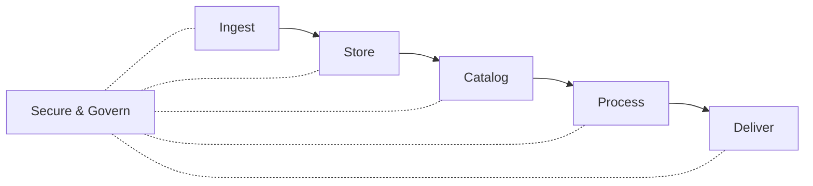

# AWS Data Engineering Review

## Foundational Roles & Concepts

Goals and buzz words include data driven organization and data democratization.

However, data challenges are abundent.

- Data and processing silos
- Excessive data movement
- Data duplication

Role of the **Data Engineer** to solve these chalenges.

- Extract valuable insights from raw data
- Design, develop, and maintain data architectures
- Run Extract, transform, and load (ETL) pipelines for data consumers.

Overarching theme is:

1. Getting data from sources
2. Making it useful
3. Serving it to stakeholders

Detailed functions may include:

- Build and manage dat ainfrastructure
- Ingest various sources
- Prepare the ingested data for analytics
- Catalog and document curated datasets
- Automate regular data workflows
- Ensure data quality, security, and compliance

Adjacent Roles include the following:

- Chief Data Officer (CDO) - Builds a culture of using data to solve problems and accelerate innovation
- Data Architect - Driven to architect technical solutions to meet business needs, focuses on solving complex data challenges to help the CDO deliver on their vision
- Data security officer - Ensures that data security, privacy, and governance are strictly defined and adhered to
- Data scientist - Constructs the means for quickly extracting business-focused insight  from data for the business to make better decisions
- Reacts to market conditions in real time, must have the ability to find data and perform analytics quickly and easily

## Data Discovery

Before arcitecting and deploying a data analytics system, the following questions must be answered.

1. Which data should be analyzed based on its value to the organization?
2. Who owns the data and where is it located?
3. Is the data usable in its current state or are transformations required?
4. Who exactly needs to consume the data?
5. After the data is curated and ready for consumption, how should it be presented?

**Data discovery** refers to the process of finding and understanding relevant data sources within an organization and the relationships between them. **It is the crucial first step!**
However, data discovery is routinely revisited to account for emerging sources.

Data discovery consists of (5) steps:

1. Define the business value, e.g. how does the data insight provide value to the organization?
2. Identify the data consumers, i.e. end users of the data insights.
   - Which insights are we currently extracting?
   - Which insights are on our roadmap?
   - What are the differenet consumption models?
   - Which tools or interfaces do the consumers use?
   - What are the data freshness requirements?
   - What is the total number of consumers and peak concurrency?
3. Identify the data sources like DBMS, files, logs, data types like structured or unstructured, and ingset modes like streaming versus batch.
4. Determine storage, catalog, and access requirements.
   - Answer why storage methods are being selected.
   - Determine long term volume requirements.
   - How do we manage governance requirements?
   - What is the disaster recovery strategy?
5. Determine the transformation requirements.

Remember to **focus on what exists, then what needs to be developed**

## AWS Data Services

Data solutions are often built in isolation with disperate ingestion, storage, manangement, and governance frameworks. This creates silos and we seek to build architectures that avoids this and puts data in the hands of all stakeholders.

A typical data workflow follows this pattern:

1. Ingest
2. Store
3. Catalog / indexed (to facilitate search)
4. Processing
5. Consumption / delivery
6. Security & governance

The following is a subset of common AWS solutions that can be used for multiple functions within a data workflow.

- **Data Lake** - A centralized repository for storage of structured, semi-structured, or unstructured data all in place. **AWS S3** provides a scalable solution for a Data Lake.
- **Ingest Services** - Getting data into your data lake can involve a number fo services.
  - **AWS Data Migration Service (DMS)** allows for ingest of relational or non-relational databases.
  - **AWS DataSync** allows for transfer of on-prem file shares, object stores, and Hadoop clusters on a scheduled basis.
  - **AWS Data Firehose** can convert a data stream into formats like Parquet or ORC. It can decompress and perform custom transformations.
  - **AWS Managed Streaming for Kafka (MKS)** provides environment for building fully managed Kafka clusters for real time streaming applications. (**Amazon Kinesis** is its fully managed cousin with simpler AWS integration).
  - **AWS IoT Core** can connect to billions of IoT devices.
  - **AWS Transfer Family** automates file transfers in and out of S3 using SFTP.
- **Data Cataloging** is the process of keeping track of data assets; understanding what data is available, where it is located, and its lineage. THe catalog is the single source of truth about the contents of a data lake. **AWS Glue** creates a catalog to enable this function and it works similar to a managed instace of Apache Hive.
- **Processing Services** focus on the transformation and formatting of data to ensure it is in a usable state for the consumer. Several services are offered.
  - **AWS Glue** - In addition to cataloging, AWS Glue allows for ETL serives to prepare and clense data. It can help classify data, extract schema, and populate the data catalog.
  - **Amazon Elastic MapReduce (EMR)** enables batch jobs on big data with Apache Spark or Hadoop. It can be run on elastic compute resources like **AWS EC2** or **AWS Elastic Kubernetes Service (EKS)**. It can run jobs stored on services like **AWS S3** and **AWS DynamoDB**. Often used for log analysis, ML applications, etc.
  - **Amazon Managed Service for Apache Flink** conduct real time filtering, aggregation, joining, extraction or other transformations using Java, Scala, Python, or SQL.
- **Analytics Services** - Delivering transformed data to consumers and stakeholders also has many services available.
  - **AWS Redshift** can analyze large structured datasets federated across many databases without moving the data to a central location.
  - **AWS Athena** allows users to query data stored in **AWS S3** using SQL provides the data are in CSV, Parquet, or ORC format.
  - **Amazon Elastic MapReduce (EMR)** enables batch jobs on big data with Apache Spark or Hadoop. It can be run on elastic compute resources like **AWS EC2** or **AWS Elastic Kubernetes Service (EKS)**. It can run jobs stored on services like **AWS S3** and **AWS DynamoDB**. Often used for log analysis, ML applications, etc.
  - **AWS QuickSight** allows users to visualize and create dashboards big data using SQL, similar to Apache Superset.
- **Security & Governance** - Security refers to protecting data from unauthorized access, breaches, or attacks. It involves safeguarding data confidentiality, integrity, and availability. While governance refers to policies, procedures, and processes that ensure the proper management, quality, and use of data.
  - **AWS Lake Formation** is a service that centrally managed fine grained access controls.
  - **IAM Roles** also manages fine grained access and permissions for human users, software users, and other microservices.
  - **AWS Key Management Service (KMS)** allows users to create and manage encryption keys, control their usage, and integrate with other AWS services for data encryption.
  - **AWS Macie** automatically discovers, classifies, and protects sensitive data such as PII.
  - **AWS DataZone** can catalog, enable discovery, enable sharing, and govern data stored in AWS, on-prem, or in thrid party sources.
  - **AWS Audit Manager** audits data usage to assess risk and compliance.

## Data Orchestration & Automation

Orchestration and automation of data workflows ensures pipelines do become error-prone or too time consuming to manage.

**Orchestration** is the coordination of multiple services to define and manage the flow of data.

**Automation** refers to using tools and services to perform repetitive data workflow tasks, e.g., like a CRON job.

Many AWS services are available to orchestrate data workflows.

- **AWS Step Functions** - An ETL visualization services that executes Lambda functions, runs batch jobs in AWS Glue, AWS EMR, or streaming services like AWS Kinesis or Data Firehose.
- **AWS Lambda** - Runs piece of code for open-ended tasks without having to provision servers. Can invoke other AWS services and microservice tasks within a workflow. Can be event driven by data sources like AWS S3, DynamoDB, Kinesis, SNS, or SQS.
- **Amazon Managed Workflows for Apache Airflow (MWAA)** - Managed Apache Airflow service to orchstrate ingest, processing, transformations and loading or run queries for analytical workflows at scale.
- **Amazon EventBridge** - A serverless service used to build event-driven applications. It can ingest from various sources and route events to various targets to invoke different stpes in a workflow. *Unclear*
- **AWS Simple Notification Service (SNS)** - A fully managed messaging service that enables message traffic to and from multiple endpoint simultaniously. Messages can be used to invoke Step Functions.
- **AWS Simple Queue Service (SQS)** - A managed message queuing service to send, store, and retrieve multiple messages of various sizes asynchronously. In essense, a message queue that allows services to poll asyncronously and cue various jobs in a workflow.

## Enhanced Orchestration & Automation

While traditional ETL workflows are often sequential and delicate. Other aproaches are available.

**Zero-ETL** - Query of data from its original source systems without requiring data movement to a new system and transformations prior to consumer. Several services have the ability to execute this approach depending on the data and use case.

- **AWS Athena** Query data stored in **AWS S3** using SQL provides the data are in CSV, Parquet, or ORC format. Often used in conjunction with **Step Functions** and **Lambda Functions** to process and analyze query results.
- **Amazon Redshift Streaming Ingest** - Can ingest streaming data without the need to stage in **AWS S3**, reducing an ETL task for common workflows.
- **Amazon Aurora + Redshift** Allows for replication of data from Aurora to Redshift in near real-time.
- **Amazon Redshift + AWS S3** Continuously ingest new files from S3 in near real time with no manual intervention.
- **Amazon OpenSearch** allows for querying data directly from S3 without performing an extraction to OpenSearch itself. *Commonly used in log analysis use cases; more info required.*

**Serverless Architecture** - While not truly "serverless", this concept refers to building and running applications without having to manage infrastructure. All the server management is performed by the cloud service provider and you only pay for the compute you use, not for the overhead of a server at rest. **Most AWS services offer a serverless option.**

## Security & Monitoring

