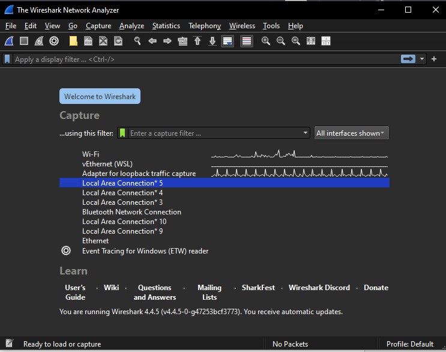
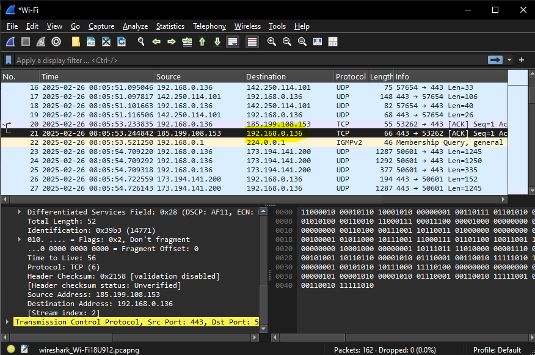
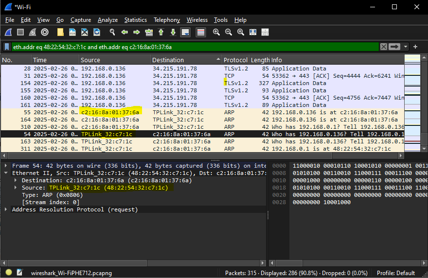
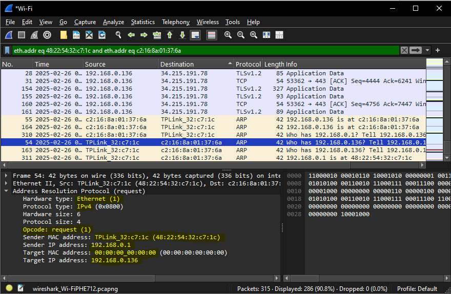
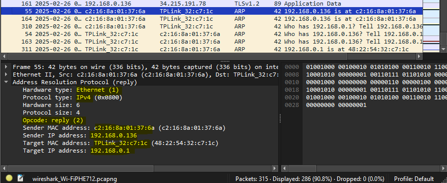
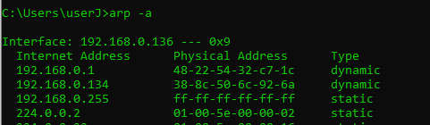

# Lab 03 - Filtering ARP Packets with Wireshark

**Name:** Jason Gillette  
**Course/Section:** IS-3413  
**Date:** 2025-02-25 

---

## Introduction

This lab aims to provide hands-on introduction to Wireshark, a network protocol analyzer. Through a series of breakpoints, I install Wireshark, capture and analyze network traffic, and interpret ARP (Address Resolution Protocol) communications. Some key points include ability to identify key networking components, filter specific traffic types, and recognize patterns in packet exchanges.

---

## Breakpoint 1

*Identify which operating system on which you installed Wireshark, and confirm that you were able to install and launch it successfully with a screenshot. Describe any challenges you encountered.*

The goal of Breakpoint 1 is to successfully install Wireshark. For this section I installed Wireshark on Windows 10. I initially tried to install on Windows Subsystem for Linux (WSL) but encountered tremendous difficulty with dependencies. To save time I resorted back to a Windows installation.

---

## Breakpoint 2

*Include a screenshot with an interesting portion of your Wireshark capture. Note the Source and Destination columns and their IP address data. Can you locate your computer’s IP address? You can find the IP address of your Windows machine using these instructions from LSU. Include a screenshot of your Wireshark window with this IP address highlighted, as well as any other interesting details.*

In this activity I was able to record traffic and identify communication with a GitHub server as demonstrated by the IP Address `185.199.108.153` in the screenshot below. Throughout the recording I was also able to recognize and highlight my own IP Address. Another interesting detail is the volume of UDP protocol throughout the recording. Further research revealed that User Datagram Protocol (UDP) is the protocol used for the video and music streaming, a reflection of the YouTube music playing in the background.

---

## Breakpoint 3

*Filter your ARP packet by “arp”, Ethernet address, and by conversation. Describe the traffic you’ve filtered in detail, with arrows or highlighting pointing to the relevant area in your Wireshark interface screenshot.*

In this activity, I recorded network traffic until observing multiple instances of ARP protocol. Once I stopped recording I was able to filter by searching `arp`, Ethernet address, and by conversation. Searching by conversation is depicted in the screenshot below with a local network router highlighted as the source MAC address.

---

## Breakpoint 4

*Examine an ARP request and ARP reply in the packet details pane and fill in these details for each. Include a Wireshark interface screenshot to validate this information as well.*

For this section I used the packet details pane to examine the Address Resolution Protocol information for both the ARP request and reply. Both request and reply are offered below with highlights of key attributes such as Hardware Type, Protocol Type, MAC Addresses, IP Addresses, and Opcode.

**The Request**
- Hardware Type: Ethernet
- Protocol Type: IPv4
- Sender MAC address: 48:22:54:32:c7:1c
- Sender IP address:Sender IP address: 192.168.0.1
- Target MAC address: 00:00:00_00:00:00
- Target IP: 192.168.0.136
- Opcode: request (1)

**The Reply**
- Hardware Type: Ethernet
- Protocol Type: IPv4
- Sender MAC address: c2:16:8a:01:37:6a
- Sender 192.168.0.136
- Target MAC address: 48:22:54:32:c7:1c
- Target IP: 192.168.0.1
- Opcode: reply (2)

---

## Breakpoint 5

*Describe the output of your arp command. Is it similar to the above, or different? Do you recognize any of the IP or MAC addresses?*

After running `arp -a` in the command line, I was able to identify all devices on my network as demonstrated in the following screenshot with most devices omitted from frame. The IP address and MAC for my current device and router are recognizable due to previous exercises.

---

## Conclusion

By completing this lab, I gained insights into network traffic analysis using Wireshark. Per the instructions, I captured and examined various network protocols, including ARP. These exercises reinforced my understanding of network packet structures, filtering techniques, and how different protocols function within a network.

---

## References

R. Mitra, “Lab 03: Title,” The University of Texas at San Antonio (2024). Last accessed: 2025-02-26

---

## Collaboration

I worked alone.