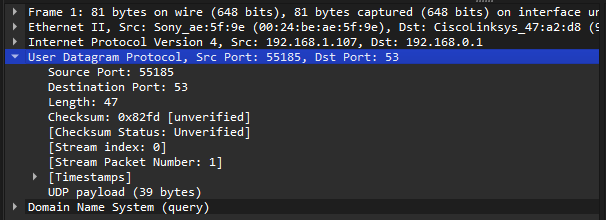

# IS6113 Lab 04 – Comparing UDP and TCP in Wireshark

**Name:** Jason Gillette 

**Course/Section:** IS-3413  

**Date:** 20250330

---

## Introduction

In this lab, we explored the key differences between UDP and TCP by analyzing packet captures in Wireshark. Based on Chris Greer’s walkthrough video, we examined how each protocol operates, and when to choose one over the other. The objective was to become comfortable with identifying protocol behaviors and header structures using Wireshark.

---

## Step 1: Prepare Your Wireshark Environment

*Describe the steps you took to download and open the provided `.pcap` file in Wireshark. Mention any setup adjustments based on the video, such as column configurations, coloring rules, or display filters.*

The instruction provided in the prompt for this section did not work as anticipated. After clicking the link embedded in the instructions and following each step highlighted, the "Download" button did not work. I navigated back to the assignment page and downloaded the `.pcapng` file from there and simply opened it with Wireshark as indicated in the screenshot below.

---

## Step 2: Explain the Differences Between UDP and TCP

Answer the following in a ~200-word paragraph:

1. How are UDP and TCP different?
2. Which one is stateless and which one is stateful?

The primary difference between UPD and TCP can be characterized in terms of *stateless vs stateful* connections. User Datagram Protocol (UDP) is stateless or connection-less. This means it does not rely on the handshake connections between client and server to transmit data and wait for a response or confirmation. It simply sends traffic without the intermediary protocols to ensure stability and reliability throughout the transfer of data. What it loses in these protocols it gains in superior speeds, making it well suited for streaming data. Transmission Control Protocol (TCP) on the other hand is a much slower and deliberate stateful connection. It conducts a three-way handshake to establish and maintain a synchronized connection. It includes features like sequence numbers for reassembly, overlapping windows to prevent data loss, acknowledgements from the client to confirm receipt, and additional error handling and congestion controls. While this introduces relative reliability, the additional overhead reduces the speed of the transaction. The trade-off between the two is ultimately one of velocity versus veracity.

Note, I did not use Microsoft Copilot for video summarization as directed. Microsoft Copilot and Microsoft Edge tooling exercise poor data security practices and I refuse to use them on my personal machine. Moreover, the subscription-based business model for services that were previously license-based is not in the best interest of end users and I recommend divorcing coursework from Microsoft dependencies. Despite this issue, I was able to use the same OpenAI GPT-4 model to perform video summarization. The result is provided below. [2][3]

*The YouTube video titled "TCP vs UDP Explained // Hands On Lab Example with Wireshark" offers a comprehensive comparison between the Transmission Control Protocol (TCP) and the User Datagram Protocol (UDP), two fundamental communication protocols in networking. It delves into the core differences in their operations, highlighting TCP's connection-oriented nature, which ensures reliable data transmission through error checking and acknowledgment mechanisms. In contrast, UDP is presented as a connection-less protocol that facilitates faster data transfer without the overhead of reliability checks, making it suitable for applications like live streaming and online gaming where speed is critical.

To provide practical insights, the video incorporates a hands-on lab demonstration using Wireshark, a network protocol analyzer. This segment allows viewers to observe real-time data packets, illustrating how TCP establishes connections via a three-way handshake and manages data sequencing and retransmission. Conversely, it showcases UDP's simplicity in sending packets without establishing a prior connection, leading to reduced latency but with a higher risk of packet loss.

By the conclusion, viewers gain a clear understanding of the trade-offs between TCP's reliability and UDP's efficiency. The video effectively equips its audience with the knowledge to choose the appropriate protocol based on specific application requirements, balancing factors like speed, reliability, and resource utilization.*

---

## Step 3: Analyze a UDP Traffic Transmission

1. Which protocol is running over UDP in this video? Highlight the protocol rows in the top
pane of the capture.

In the provided examples, DNS is running over UDP as demonstrated in the screenshot below.

2. What fields are in the UDP header? Highlight each field in your capture and explain the
function of each one.

- Source Port – Identifies the sending application’s port number.  
- Destination Port – Identifies the receiving application’s port number.  
- Length – Specifies the total length of the UDP header and data in bytes.  
- Checksum – Used for error checking the header and data (optional in IPv4, mandatory in IPv6).

---

## Step 4: Analyze a TCP Traffic Transmission

1. What are the three parts of the TCP handshake? Highlight these in the pcap and explain the function of each one.

- SYN (Synchronize) – Client sends a SYN packet to initiate a connection with propose initial sequence numbers.
- SYN-ACK (Synchronize-Acknowledge) – The server responds with a SYN-ACK packet to acknowledge the request and provide its own sequence number.
- ACK (Acknowledge) – Client sends an ACK packet to confirm receipt of the server’s SYN-ACK to complete the connection setup.

2. List and describe TCP header fields not found in UDP.

- Sequence Number – Indicates the order of bytes sent to ensure correct reassembly on the receiving side.
- Acknowledgment Number – Confirms receipt of data by indicating the next expected byte from the sender.
- Data Offset / header length – Specifies the size of the TCP header so the receiver knows where the data begins.
- Reserved Bits – Set aside for future use and should be set to zero.
- Control Flags (e.g., SYN, ACK, FIN, RST, PSH, URG) – Manage connection state and control the flow of data (e.g., initiating or terminating connections).
- Window Size – Advertises the amount of data the receiver can accept without acknowledgment (used for flow control).
- Checksum – Verifies the integrity of the header and data, similar to UDP but mandatory in TCP (also in UDP).
- Urgent Pointer – Points to urgent data that should be prioritized by the receiver when the URG flag is set.
- Options – Used for additional features like setting the maximum segment size (MSS) or enabling TCP timestamps.

---

## Step 5: Describe When to Use TCP or UDP

1. Explain how TCP controls congestion.

TCP controls congestion by adjusting the data transmission rate based on network conditions, primarily through three mechanisms, slow-start, congestion avoidance, and fast-retransmit. Slow start begins transmission with a small congestion window and increases it exponentially to probe the network capacity. Congestion avoidance gradually increases the window size linearly to avoid overwhelming the network. Fast Retransmit quickly detects and recovers from packet loss without waiting for a timeout by using duplicate ACKs.

2. Discuss when you would use TCP vs. UDP based on latency, bandwidth, and reliability.

As mentioned in step 1, TCP prioritized reliability where UDP prioritizes speed. To put it differently, you would use TCP when reliability and data integrity are crucial, such as in email, or file transfers, since it ensures ordered delivery and retransmits lost packets. In contrast, UDP is better for applications requiring low latency and high speed, like video streaming, VoIP, or gaming, where occasional packet loss is acceptable. TCP handles congestion deliberately, while UDP consumes less bandwidth due to its minimal overhead.

3. Mention at least one interesting detail from the `.pcap` file.

While analyzing the packets within this `.pcap` file, it appears that the user submits a `GET` call to retrieve a `.png` file from the web server. The `.png` file is sent over eight separate packets using TCP protocol. I find this interesting because I'm now wondering how this compares to the transfer of each individual frame of a video in a typical UDP protocol such as a frame within a YouTube video. A quick analysis of my own network traffic demonstrates significantly greater compression as there is not nearly as much traffic for video streaming when considering frames-per-second.

---

## Conclusion

*Reflect on your experience with this lab:*

1. What challenges did you face or what stood out to you?

Understanding the instructions relative to the reference video proved to be the biggest challenge. In terms of time, re-reading instructions occupied a significant portion of the assignment. This was especially the case in step when it wasn't clear to me which UDP traffic I should be referencing to answer the question.

2. How did you resolve those challenges or what did you learn?

After re-watching the video, I understood the reference to DNS traffic for inspecting UDP headers and was able to move forward. Other than this the assignment was straightforward and involved analyzing the Wireshark packets and looking back at the reading to recall each header field.

3. How can you apply these networking concepts going forward? 

Personally, I am not a networking professional and I do not anticipate analyzing network traffic on a routine basis. However, Wireshark packet analysis has allowed me to better understand the core concepts involved and provides me with a surface level understanding that I can apply in other areas such as Kubernetes or basic network troubleshooting.

---

## References

[1] R. Mitra, “Lab 04: Comparing UDP and TCP in Wireshark,” The University of Texas at San Antonio (2025). Last accessed: <access-date>.

[2] ChatGPT [GPT-4o language model], response to “Please summarize the YouTube video at https://www.youtube.com/watch?v=V1CxV6Vg7_U in 200 to 220 words.” OpenAI, March 2025. Accessed: March 30, 2025.

[3] C. Greer, “TCP vs UDP Explained // Hands On Lab Example with Wireshark,” YouTube, Nov. 1, 2022. [Online]. Available: https://www.youtube.com/watch?v=V1CxV6Vg7_U. Accessed: March 30, 2025.

[4] ChatGPT [GPT-4o language model], response to “Use the file attached to generate a markdown template structured for completion of the referenced assignment.” OpenAI, March 2025. Accessed: March 30, 2025.

---

## Collaboration

I did not collaborate with another individual on this assignment.