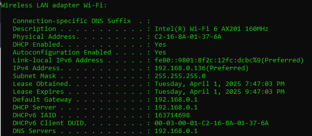
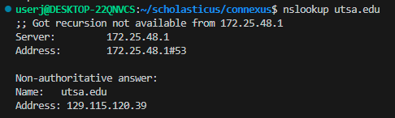
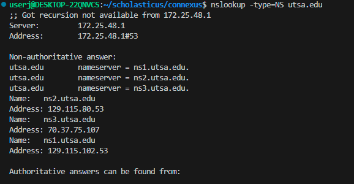
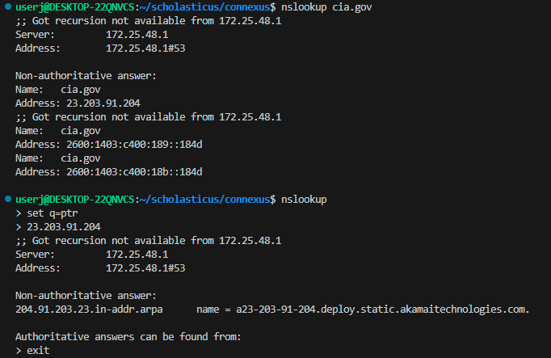
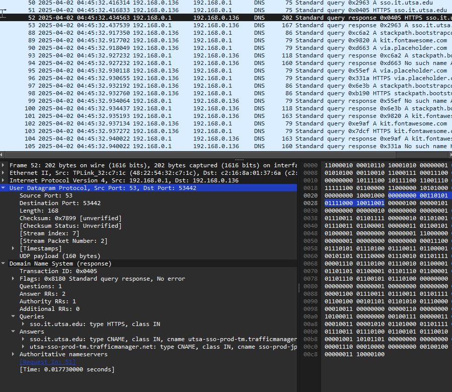

# Lab 05 – Investigating DNS

**Name:** Jason Gillette <br>
**Course/Section:** IS-6113 <br>
**Date:** 20250401

---

## Introduction

In this lab, we examine how the Domain Name System (DNS) operates on the client side. Through a series of exercises involving system inspection, `nslookup`, and Wireshark, we explore DNS functionality including query resolution, server roles, and reverse lookups.

---

## Breakpoint 01: Local DHCP and DNS Specifications

1. What is the role of DHCP and DNS in your access to the Internet?

DHCP (Dynamic Host Configuration Protocol) allows devices to obtain IP addresses dynamically by leasing them from a pool managed by a DHCP server. DNS (Domain Name System) maps human-readable domain names to IP addresses, enabling users to access websites using names instead of numerical IPs. DNS operates in a hierarchical structure, starting with root servers, followed by top-level domains (like .com) and second- or third-level domain names (like utsa.edu).

2. Is DHCP enabled? Is it autoconfigured? How long is the DHCP lease?

Yes, DHCP is enabled, as shown by the line `DHCP Enabled. . . . : Yes`.
Autoconfiguration is also enabled, allowing fallback addressing if DHCP were unavailable, though it's not being used here.
My device received an IPv4 address from the DHCP server at `192.168.0.1`.
The lease was obtained on April 1, 2025 at 7:47:03 PM and expires two hours later at 9:47:03 PM, indicating a lease duration of 2 hours.

3. What is the IP address of the DHCP and DNS servers?

Home network router acts as both DHCP Server and DNS Server at IP Address `192.168.0.1`.



---

## Breakpoint 02: Use `nslookup`

Run: `nslookup utsa.edu` or another domain and describe:

1. What information was returned?

DNS response included a non-authoritative answer indicating the IP address for `utsa.edu` is `129.115.120.39`. It also noted that recursion is not available from the DNS server.

2. What is the name and IP address of the DNS server?

DNS server that responded is at IP address `172.25.48.1`. No hostname was provided, only the IP.

3. What is the IP address of the requested domain?

The IP address of utsa.edu returned in the response is `129.115.120.39`.



---

## Breakpoint 03: Authoritative vs Non-Authoritative Servers

Run: `nslookup -type=NS utsa.edu` or another domain and explain:

1. Which servers were returned?

The response listed three name servers for the utsa.edu domain, ns1.utsa.edu, ns2.utsa.edu, and ns3.utsa.edu as indicated in the screenshot below.

2. Was the response authoritative or non-authoritative?

The response was non-authoritative, as indicated by the message `Non-authoritative answer:` line, meaning the data was returned from a DNS server cache from a previous look-up and not directly from the authoritative name servers.


3. What additional information was included?

Only additional information returned was the IP addresses of the three name servers, ns2.utsa.edu
at `129.115.80.53`, ns3.utsa.edu at `70.37.75.107`, and ns1.utsa.edu at `129.115.102.53`.




---

## Breakpoint 04: Reverse DNS Lookup

Run a reverse DNS lookup using:

```bash
> nslookup  
> set q=ptr  
> <IP_ADDRESS>
```

1. What host name is returned?

The host name returned was `a23-203-91-204.deploy.static.akamaitechnologies.com.`.

2. Was the lookup successful?

Yes, the lookup was successful, as a valid PTR (reverse DNS) record was returned. However, it was a non-authoritative answer that did not correspond to the direct look-up (non-reverse), meaning the information was served from a cached record by the DNS server at `172.25.48.1`.



---

## Breakpoint 05: DNS Packet Analysis in Wireshark

Answer the following based on your filtered DNS capture:

1. Locate the first DNS query message in a series. What is the packet number in the trace for the DNS query message? Is this query message sent over UDP or TCP?

The first DNS query in the trace is packet number 49, which is a standard query for utsa.edu.
This query is sent over UDP, as shown in the protocol column and confirmed in the packet details pane.

2. Now locate the corresponding DNS response to the initial DNS query. What is the packet number in the trace for the DNS response message? Is this response message received via UDP or TCP?

The DNS response to the initial query is found in packet number 51. This response message is received via UDP, as shown in the protocol column and verified in the packet details.

3. What is the destination port for the DNS query message? What is the source port of the DNS response message?

`User Datagram Protocol, Src Port: 53, Dst Port: 56139`

4. To what IP address is the DNS query message sent?

For the instance detailed below the destination port is my local network router at `192.168.0.1` as this is the nearest cache.

5. Examine the DNS query message. How many “questions” does this DNS message contain? How many “answers” answers does it contain?

There is one question and two answers. 

6. Examine the DNS response message to the initial query message. How many “questions” does this DNS message contain? How many “answers” answers does it contain? How many answers does the response have? What information is contained in the answers? How many additional resource records are returned? What additional information is included in these additional resource records?

The DNS response contains 1 question and 2 answers, which provide the IPv4 addresses for utsa.edu.
It also includes 1 authority records and 2 additional resource records, which provide IP addresses for the name servers listed in the response.



---

## Conclusion

In this lab, I gained a deeper understanding of how DNS operates on client systems, including how queries are resolved locally or through recursive lookups. Using nslookup allowed me to explore different record types and observe the role of authoritative and non-authoritative servers. Wireshark provided valuable insight into DNS message structure and how queries and responses are transmitted across the network. One challenge I encountered was interpreting non-authoritative responses and tracking the correct DNS packets in Wireshark, but filtering techniques and packet details helped clarify the process. This hands-on experience will be useful in future network troubleshooting, particularly when diagnosing domain resolution issues or identifying misconfigured DNS settings.

---

## References

[1] R. Mitra, “Lab 05: Investigating DNS,” The University of Texas at San Antonio (2025). Last accessed: *April 1t, 2025*.   

ChatGPT [GPT-4 language model], response to “Generate a markdown lab template for Lab-05_Investigating-DNS.pdf,” OpenAI, March 2025. Accessed: March 30, 2025.

---

## Collaboration

No Collaboration on this assignment.