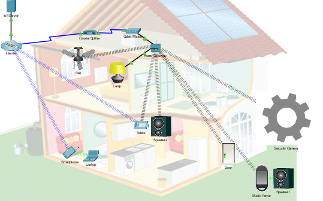

# Lab 07 – Exploring Internet of Things with Cisco Packet Tracer

**Name:**  Jason Gillette  
**Course/Section:** IS-3413  
**Date:**  April 29, 2025

---

## Introduction (5 pts)

In this lab, we use Cisco Packet Tracer to explore Internet of Things (IoT) technologies by building and managing smart network environments. The lab guides us through IoT device setup, environmental control, device registration, scripting, and testing through a series of practical modules.

---

## Breakpoint 1 – Add IoT Devices in Packet Tracer (1.1.3) (10 pts)

### Summary

In this activity, I explored a prebuilt smart home network within Cisco Packet Tracer. I began by reviewing the available IoT devices in the End Devices > Home category and observing their types and functions. I then examined the existing smart home setup, interacted with devices like the Smart Fan and Smart Lamp, and accessed the Home Gateway through the Tablet to manage the network.

Next, I added a Wind Detector as a wireless IoT device, configured its authentication settings, and confirmed it was properly registered with the Home Gateway. I followed by adding a Smart Sprinkler using a wired Ethernet connection, configuring DHCP, and verifying its presence on the network. Lastly, I installed a Water Meter, connected it to the sprinkler via an IoT custom cable, and confirmed its successful registration. These steps helped me understand how to extend and manage a mixed IoT network in Packet Tracer.

### Screenshot  

Screenshots listed below illustrate the logical network within the IoT exercise and the completion of all required tasks.

*Figure 1: Activity grading*

*Figure 2: IoT Devices added to the workspace*

---

## Breakpoint 2 – Connect Devices to a Home Gateway (1.2.3) (5 pts)

### Summary

In this activity, I built a functional smart home network by adding a Home Gateway and connecting multiple IoT and user devices. First, I added the Home Gateway to the workspace and connected it to the existing cable modem using a copper straight-through cable. I then added a wireless tablet and configured it to join the Home Gateway’s SSID, successfully accessing the IoT Monitor interface.

Next, I added a wired smart Lamp and configured it for DHCP via FastEthernet, then added two wireless IoT devices—a Fan and a Door—and verified their network connections. All three devices were then registered with the Home Gateway’s IoT server. Finally, I added a Bluetooth Speaker and a Music Player, enabled their Bluetooth ports, and successfully paired them. I verified that all devices could be interacted with either directly in the workspace or through the IoT Monitor app on the tablet.

### Screenshot  

*Figure 3: Activity grading*

*Figure 4: IoT Devices added to the workspace*

---

## Breakpoint 3 – Connect and Control Devices Using a Registration Server (1.2.6) (5 pts)

### Summary

In this activity, I transitioned the smart devices in the network from being managed locally via the Home Gateway to being registered with a remote IoT server hosted at home.com. I began by accessing the Home Gateway from the Tablet’s IoT Monitor to verify the existing devices (Fan, Lamp, and Door). Then, I logged into the remote IoT server via the web browser and proceeded to reconfigure each IoT device to register with home.com using the appropriate credentials.

While the Fan and Door registered successfully, I encountered difficulties connecting the Lamp. It failed to appear on the remote server until I manually revisited its Ethernet configuration and reset its interface to use DHCP again. After this adjustment, the Lamp was successfully registered with the remote IoT server and appeared alongside the other devices.

In the second part of the activity, I established Bluetooth tethering between a Smartphone and a Laptop. After enabling Bluetooth on both devices and pairing them, I used the tethering option to share the Smartphone’s cellular connection with the Laptop. I validated internet connectivity by successfully pinging home.com and confirming that the Laptop could access the IoT server through the Smartphone’s cellular data.

### Screenshot  

*Figure 5: Activity grading*

*Figure 6: IoT Devices added to the workspace*

---

## Breakpoint 4 – Modify and Monitor Environmental Controls (2.0.5) (10 pts)

### Summary

In this activity, I used Packet Tracer’s Environments panel to explore and edit environmental conditions. I focused on Ambient Temperature, adjusting keyframes to simulate a summer day with values ranging from 20°C to 37°C. The changes updated the temperature chart in real time, allowing me to observe how IoT devices could respond to dynamic environmental data.

### Screenshot  

**Figure 7: Environment Activity Grading*

---

## Breakpoint 5 – Create Your Own IoT Thing (2.1.3) (10 pts)

### Summary

In this activity, I created a custom IoT device in Packet Tracer—a Security Camera—using the Thing Editor. I renamed the device, assigned it a digital interface, uploaded a custom icon, and connected it to the wireless network. I confirmed connectivity by successfully pinging the camera from a tablet. I then saved the Security Camera as a reusable template using the Device Template Manager, making it available for future use in other Packet Tracer projects.

### Screenshot  

*Figure 8: Activity grading*

*Figure 9: IoT Devices added to the workspace*

---

## Breakpoint 6 – Modify an Existing Script (2.1.6) (10 pts)

### Summary

In this activity, I enhanced the Security Camera IoT device by adding a second icon to represent motion detection and writing a custom behavior script. I imported the motion-activated image, configured rule-based icon switching, and copied JavaScript code from a Motion Detector device. After updating the device type in the script and running the program, I registered the camera with a remote IoT server. I tested the camera by simulating motion, which triggered the icon to change and updated the device's status in the server interface, confirming the camera's dynamic behavior.

### Screenshot  

*Figure 10: Activity grading*

*Figure 11: IoT Devices active in the workspace*

---

## Breakpoint 7 – Course Final Exam Results (5 pts)

### Summary

To complete the lab, I took a short five-question quiz covering key concepts such as IoT server configuration, device registration within the workspace, and environmental control settings in Packet Tracer. The quiz reinforced the practical knowledge gained throughout the activities.

### Screenshot  

*Figure 12: exam results*

---

## Limitations / Conclusion (5 pts)

During this lab, I found configuring device connectivity and registration particularly interesting, especially working with both local and remote IoT servers. One challenge I encountered was getting the Lamp device to register properly, which I resolved by reconfiguring its Ethernet settings. I also learned how to script and customize IoT behavior, which added a practical layer to the activity. These skills—network setup, device registration, and environment simulation—are directly applicable to real-world IoT deployments and smart home automation projects.

---

## References (5 pts)

1. R. Mitra, “Lab 07: Exploring IoT,” The University of Texas at San Antonio (2025). Last accessed: April 29, 2025.
2. Cisco SkillsForAll, “Exploring IoT with Cisco Packet Tracer,” https://skillsforall.com/course/exploring-iot-cisco-packet-tracer
3. OpenAI ChatGPT [GPT-4], response to “Generate markdown template aligned with IoT lab grading criteria,” OpenAI, April 2025. Accessed: April 29, 2025.

---

## Collaboration (5 pts)

I completed this lab independently. 
