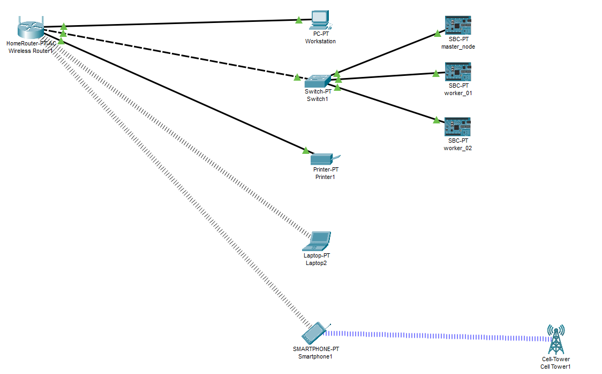
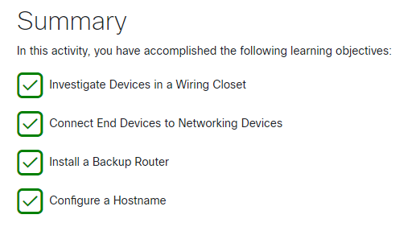
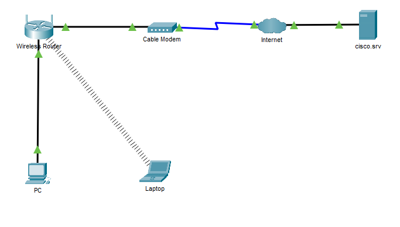
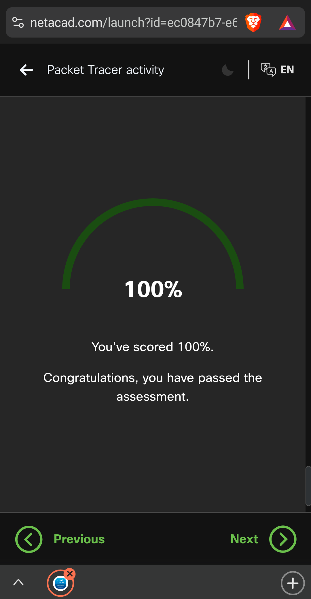

# Lab 02 - Getting Started with Cisco Packet Tracer

**Name:** Jason Gillette  
**Course/Section:** IS-3413  
**Date:** 2025-02-14 

---

## Introduction

The goal of this lab is an introducing *Cisco Packet Tracer*, a network simulation tool. This tool has users to design, configure, and troubleshoot network topologies without needing physical hardware. As part of the lab, we create a Cisco Networking Academy account and enroll in the *Getting Started with Cisco Packet Tracer* course. Each exercise is an opportunity to gain familiarity with Packet Tracer’s interface, functionalities, and network-building capabilities, setting conditions for future networking design.

---

## Breakpoint 1

The goal of Breakpoint 1 is to complete the "1.0: Home Network" section in Cisco Packet Tracer. This involves designing a basic home network topology, demonstrating an understanding of network components and their connections. Below is a screenshot demonstrating completion of this exercise. It shows a home wireless router with ethernet connection to a primary workstation, a non-managed network switch, a cluster of (3) single board computers, and a printer. The home network also depicts a wireless connection to a laptop and a smart phone. The smart phone also connects to a 4G/5G cellular network.

---

## Breakpoint 2

In this activity, I explored the physical view of a wiring closet in Cisco Packet Tracer, examining key networking devices such as routers, switches, and patch panels. I identified their roles and how they interconnect within the network infrastructure. Next, I established network connectivity by connecting end devices (PC) to networking devices (Switch) using appropriate cables, ensuring proper port selection. After setting up the connections, I performed a router installation and backup, configuring its settings and saving the startup configuration. Finally, I accessed the router’s terminal interface to configure a hostname, using the CLI to issue the hostname command, personalizing the device for easier identification within the network. These steps are confirmed in the screenshot below.

---

## Breakpoint 3

In this activity, a simple network is created in Cisco Packet Tracer by adding and connecting a PC, Laptop, and Cable Modem in the Logical Workspace. Devices are linked using appropriate cables, including a copper straight-through cable for the PC and a coaxial cable for the modem. The PC is configured to obtain an IP address dynamically via DHCP, and connectivity is verified using the ipconfig /all command and a ping test to cisco.srv. The Laptop is modified to use a wireless NIC, connected to the HomeNetwork, and verified by accessing a webpage through the browser. The activity ensures understanding of basic networking setup, device connectivity, and IP configuration.

**Please note the assessment portion of this activity is not functional, required values are listed below.**

Laptop:
- IPv4 - 192.168.0.3
- Subnet Mask - 255.255.255.0
- Default Gateway - 192.168.0.1

PC:
- IPv4 - 192.168.02
- Subnet Mask - 255.255.255.0
- Default Gateway - 192.168.0.1

---

## Breakpoint 4

For the final exam, five basic question were covered detailing the IPv4 address, the Default Gateway, navigation via web browser to test connection, and identifying connection type. The results of this exam is included in the image below.

**Note, the exam had to be completed on a smartphone due to issues with the network academy website.**

---

## Breakpoint 5

The home network in the final exam was a simple setup consisting of a PC connected via Ethernet, a laptop connected via Wi-Fi, a home router, and a cable modem. In comparison, my own home network may have more devices and a more complex structure, including additional devices such as smartphones, smart TVs, gaming consoles, and IoT devices like smart speakers and security cameras. My home network would include multiple wired and wireless connections to ensure stable connectivity for different devices. High-priority devices like a desktop PC and smart TV would be connected via Ethernet for lower latency and more reliable speeds. Meanwhile, laptops, tablets, and mobile devices would connect via Wi-Fi for convenience. A dual-band Wi-Fi system may be used to optimize coverage across different areas of the home. Additionally, I would configure network security measures like strong encryption and firewall settings to enhance safety.

---

## Conclusion

This lab introduced Cisco Packet Tracer and basic network setup, but the biggest challenge I faced was accessing course materials and dealing with unresponsive assessments on the website, which took up a significant amount of time. Navigating these issues made it difficult to focus on the core networking concepts. Aside from that, the actual network setup and device configuration were relatively straightforward. However, I struggled with command-line configuration, particularly understanding the necessary commands for device setup. To address this, I referenced Packet Tracer documentation and networking guides, but I still feel that more practice is needed to become comfortable with CLI-based configurations. Moving forward, I plan to focus more on improving my command-line skills and ensuring I troubleshoot access issues earlier to spend more time on the actual networking concepts.

---

## References

R. Mitra, “Lab 03: Title,” The University of Texas at San Antonio (2024). Last accessed: Date.

---

## Collaboration

I worked alone.
