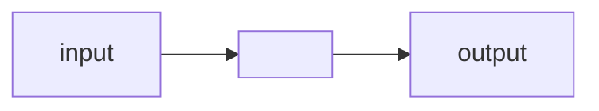

# CS45 Week 0 - Scratch

Course is ultimately one of problem solving. Problem solving can be represented in a model of inputs and outputs.



In order to problem solve and collaborate we need to be able to do so in a global or universally understood manner. For example, if we were to count we may do so by simply counting on our fingers like one, two, three, etc. This system is known as *base-1*. On a single hand, base-1 allows us to count to five. However, if we use *base-2* (binary), we can count up to 31 on each hand as each finger represents a different state.

## Representing Numbers

The concept of state in binary represents zero and one / on and off. Each representation of binary state is known as a *bit*. Compute and memory essentially consiststs of millions of transistors or switches in a state of zero or one. For example, consider we have three switches. How high can we count with a binary representation?

```plaintext
0 0 0 = 0
0 0 1 = 1
0 1 0 = 2
0 1 1 = 3
1 0 0 = 4
1 0 1 = 5
1 1 0 = 6
1 1 1 = 7
```

We have eight distinct patterns and we start count at zero, all nodes off to all nodes on, leaving us with the ability to count to seven.

Compare this to our well known decimal system (*base-10*), where each digit in a number represents a value multiplied by its placement. We see **ten** possibilities for each placeholder.

```plaintext
example: 123
(1*100) + (2*10) + (3*1)
(100) + (20) + (3) = 123
```

Translating this to binary, each placeholder is weighted by two vice ten. So we can represent digits as follows.

```plainttext
(x*4) + (x*2) + (x*1)
(x*8) + (x*4) + (x*2) + (x*1)
(x*16) + (x*8) + (x*4) + (x*2) + (x*1)
(x*32) = (x*16) + (x*8) + (x*4) + (x*2) + (x*1)
```

So we can see...

```plaintext
example: 0 1 0
(0*4) + (1*2) + (0*1) = 2
```

We can easily calculate the max value represted given the number of bits available:

```plaintext
3-bit example: 111
(1*4) + (1*2) + (1*1) = 7

8-bit example: 11111111
(1*128) + (1*64) + (1*32) + (1*16) + (1*8) + (1*4) + (1*2) + (1*1) = 255
```

There are obvious limitations to representing numbers bits alone, so we often use larger units like *Byte*. THere are **eight bits in one byte**; representing a maximum decimal value of 256 (255 + zero = 256)

## Representing Letters

It should be clear up to this point that we can represent any range of numbers using the binary system, but what about natural language, like the capital letter "A"?

There is an agreed upon standard that letters will be represented by a designated number. For example, capital "A" is represented by `01000001`, i.e., the decimal number 65. Captial "B" is represented by `01000010` or 66, and so on. Similarly, lower case "a" is `01100001`, 97, and lower case "b" is `01100010`. Bottom line is that sequences of letters are represented by designated contiguous ranges of numbers. This agreed upon standard is **ASCII**.

**ASCII** - The American Standard Code for Information Interchange

The trouble with the ASCII standard is that they only allocated 8-bits for upper case letters, lower case letters, and punctuation which limits us to 256 character representations. This is enough for english plus other latin alphabet characters but it is not enough to represent the majority of human written language.

In contrast, 32-bits would allow us to represent 4 billion different characters. This is the goal of an updated standard called **Unicode**. Unicode seeks to represent all human language past, present, and future, including pictograms like emojis. Unicode is backwards compatible with ASCII, so all english letter representations are the same.

## Representing Color

STOP: Next section is color represetation (38:51) https://youtu.be/2WtPyqwTLKM?t=2328
